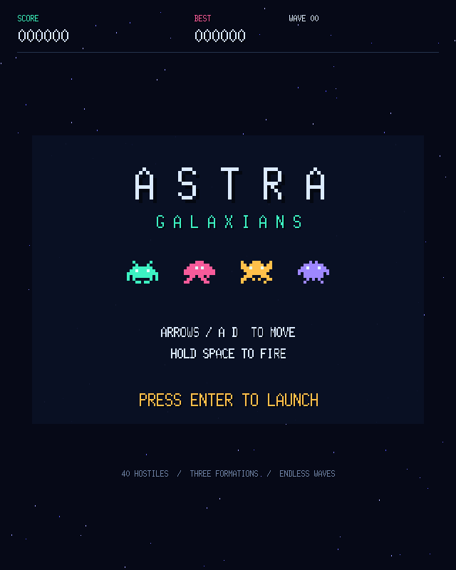
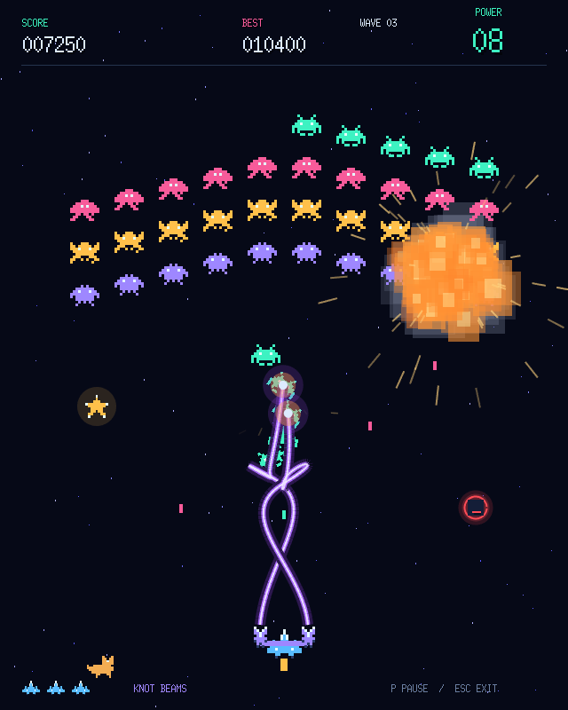

# ASTRA GALAXIANS

A Galaxians-inspired arcade game built with Go and Ebitengine. Pilot your spaceship, shoot aliens, and survive increasingly difficult waves with retro pixel graphics, chiptune music, and large particle explosions.

## Screenshots

The intro featuring pixel aliens and retro typography:



A staged combat scene featuring the highest weapon level: two continuous lasers, moving knots, and large particle explosions. Both screenshots were captured using the game's own renderer.



## Gameplay

Four types of aliens arrive in waves of 40, arranged in various formations. They fly in along smooth paths, rotate to match their direction of movement, and eventually break away into diving attacks. You have three lives. Defeating an alien awards 100 points, or 250 while it is attacking. The high score is kept until you exit the program.

Your weapon upgrades from a **blaster** to **homing missiles**, **rapid laser pulses**, and finally **continuous lasers** that track different targets and form moving knots. The main cannon remains available at every level.

| Pickup | Effect |
| --- | --- |
| Green glowing capsule | Upgrades the weapon by one level and sets the weapon timer to 10 seconds. At the maximum level, the timer remains unchanged. |
| Red glowing capsule | Downgrades the weapon by one level and sets the weapon timer to 10 seconds. |
| Yellow pulsing star | Adds 5 seconds without changing the weapon level. |

The countdown appears in the top right when you have an upgraded weapon. When time runs out, the weapon reverts to the blaster. The countdown pauses throughout the entire break between waves, including the music and the wait afterward, and resumes when the next wave begins. At the lowest level, only upgrades drop; at the highest level, only downgrades and stars drop. Projectiles already fired complete their course normally when the weapon is downgraded, while continuous lasers retract into the cannons.

The intro features a SID-inspired chiptune that plays once. Between waves, the first part of a shorter track plays. It fades out before repeating, after about 5.7 seconds, followed by a two-second pause. Only sound effects play during active waves. When the last life is lost, the ship explodes into flames, smoke, and falling pixel fragments before the game over screen appears. A small, harmless pixel cat occasionally walks along the bottom of the screen.

## Attract mode

Once the intro track finishes, the intro remains on screen for ten seconds before fading out. The game then shows an automatic demonstration starting at a random wave. The ship steers and fires on its own, showcases different weapons, and cannot lose lives during the demonstration. The high score is unaffected.

The demonstration has no sound effects or between-wave jingles. Instead, it plays the original C64-inspired track **Orbit Runner**, which lasts about 102 seconds and features heavy bass, portamento, pulse waves, and rapid arpeggios. Near the end, the audio and visuals fade out before the intro restarts with a fade-in and intro music. A new keypress or mouse click during the demonstration or the transition into it triggers the same return to the intro. This also applies to Esc and P. Enter or Space from the regular intro still starts a normal game.

## Controls

| Key | Action |
| --- | --- |
| Enter or Space | Start from the intro after the fade-in. |
| Left/right arrow or A/D | Move the ship. |
| Hold Space | Fire the main cannon and available side weapons. |
| P | Pause or resume. The countdown also pauses. |
| Esc | Quit from the intro or during gameplay. |
| Any key or mouse click on the game over screen | Start fading back to the intro. |

The game over screen also returns to the intro automatically after ten seconds. The ship explosion finishes before this screen appears; keypresses do not skip the explosion.

## Building and running

You need **Go 1.27.1 or later**, a graphical desktop, and network access for the initial dependency download. Run the commands from the project directory.

Run directly:

```sh
go run .
```

Build and run on macOS or Linux:

```sh
go build -o bin/astra-galaxians .
./bin/astra-galaxians
```

Build and run on Windows using PowerShell:

```powershell
go build -o bin/astra-galaxians.exe .
.\bin\astra-galaxians.exe
```

Go downloads dependencies automatically. On Linux, Ebitengine also requires system development libraries for graphics and audio, including X11, OpenGL, and ALSA. The project has been built and tested on macOS; Windows and Linux have not been verified here.

## Technical information

The game uses **Ebitengine 2.10.0**, a logical resolution of **640 × 800**, and a resizable window. Alien movement and laser paths use cubic Bézier curves. Pixel graphics are generated in Go, while music and sound effects are synthesized as stereo PCM at 44.1 kHz. Particles have limited lifetimes, and ship debris is affected by gravity. No external image or audio files are required, and scores are not saved between launches.

The project is organized as follows:

```text
main.go           Entry point for go run .
internal/game/    Game logic, graphics, audio, and tests
bin/              Built executables (ignored by Git)
docs/screenshots/ Screenshots used in the README
```

In `internal/game/`, the main loop is in `game.go`, startup is in `run.go`, weapons are in `weapons.go`, and audio is in `sound.go`, `sid_music.go`, and `attract_music.go`. Particles, the ship explosion, screen transitions, attract mode, and the cat each have their own files. Tests live alongside the code they test.

Run tests and static analysis:

```sh
go test ./...
go vet ./...
```

Tests cover formations, movement paths, weapons, pickups, timing, explosions, screen transitions, and generated audio data, among other things.
